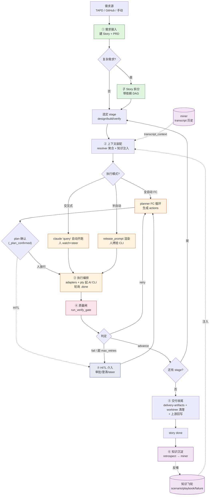
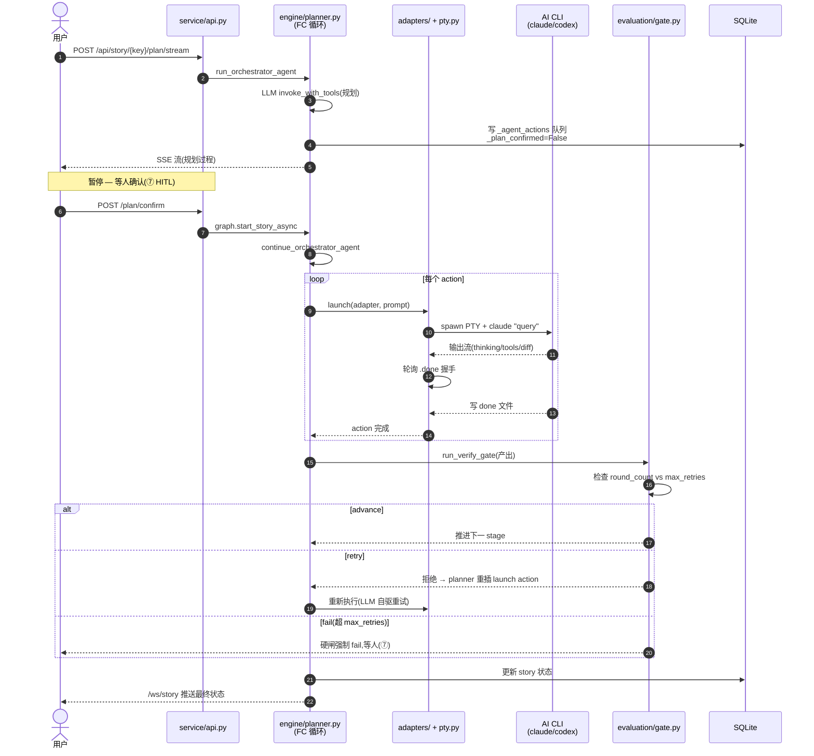
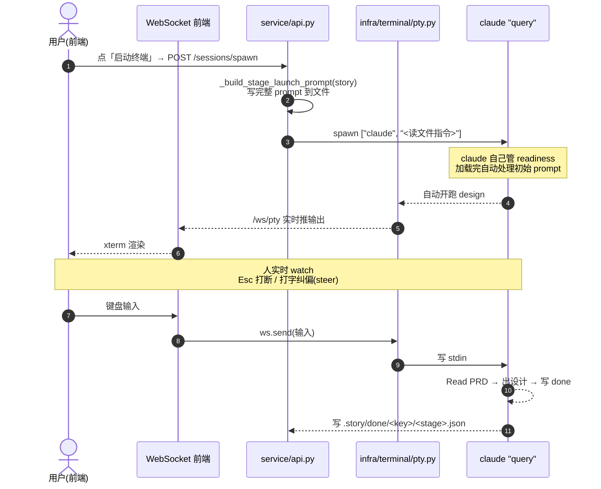
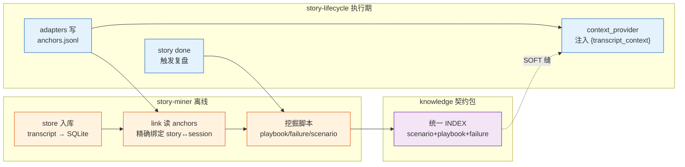
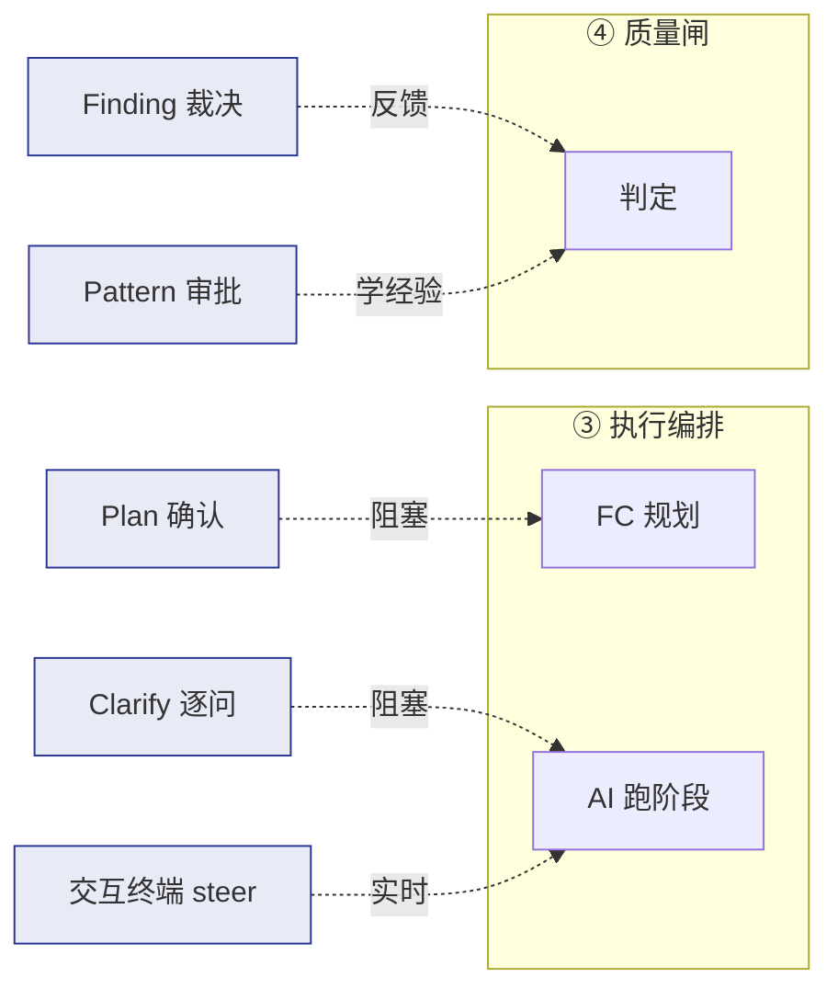

# 01 · 端到端业务流程

> 一个需求(Story)从进入系统到交付,经过哪些业务步骤。
> 把 87 个 API 端点按调用时序串起来,得到这条主线。

## 主线:Story 生命周期

```
①接入    ②规划       ③准备         ④执行(可循环)      ⑤验证      ⑥交付     ⑦沉淀
─────────────────────────────────────────────────────────────────────────────
需求源 ──▶ 建 Story ──▶ 注入上下文 ──▶ AI CLI 跑阶段 ──▶ Gate 闸 ──▶ 交付包 ──▶ 复盘
TAPD     /api/story   /context      /plan/stream      /gate      /delivery  /done
GitHub   /sub         /release-     /plan/confirm     /quality   /context   → miner
手动     /intake      prompt        /pty/spawn        /findings  /pack      → 飞轮
                       /worktrees    /answer
                                     /clarify
                                     /wait              ↑
                                     └── retry ◀─ gate 拒 ┘
```

**核心 insight**:这本质是一条 **AI 驱动的 SDLC 流水线**,跟传统 CI/CD 的区别是——流水线的每个"工序"不是脚本,而是 **AI CLI 会话**,由编排引擎规划、执行、验证、推进。

## 业务流程图(Flowchart)



## 全自动 FC 模式时序(系统主路径)



## 交互式终端模式时序(当前主方向)

> 最近 commits 的主线:`claude "query"` 取代 PTY 注入。



## 两条横向贯穿的轴

### 知识飞轮轴(模块⑥,跨包)



### HITL 轴(模块⑦,横切③④)



## 与业界参考架构的对照

对照 [Augment Code 的 AI SDLC 五层参考架构](https://www.augmentcode.com/guides/ai-sdlc-framework-reference-architecture):

| 业界层 | 本项目对应模块 |
|---|---|
| Governance(治理) | ④ 质量闸 + ⑦ HITL(Profile + Gate 硬闸 + 审批) |
| Agent Execution(agent 执行) | ③ adapters + pty |
| Orchestration(编排) | ③ planner FC 循环 + stage_graph |
| Platform/Knowledge(平台知识) | **⑥ 知识飞轮(本项目独有强项)** |
| Observability(观测) | observability + loop-trace + debug |

**差异化**:大多数同类系统(如 [ai-sdlc.io](https://ai-sdlc.io/))做编排但不闭环沉淀经验。本项目靠 miner + knowledge 契约 + SOFT 缝,把每次执行的经验反哺下次——这是 `dev-flywheel` 名字的实质。
