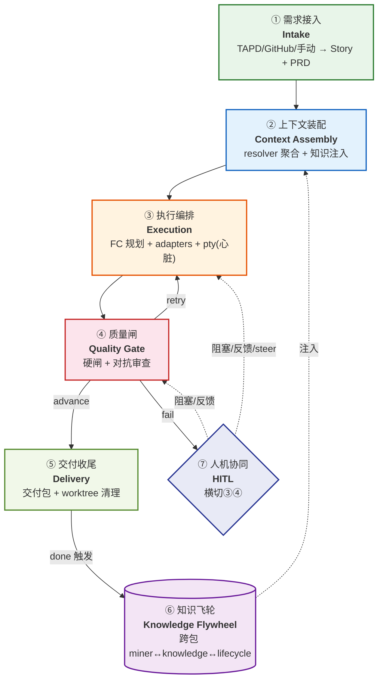

# 02 · 七大业务模块总览

> 按 Story 生命周期时序划分的 7 个业务大模块。每个模块有清晰的输入/输出/边界,落到明确的代码位置。
> 单模块详解见 [03-module-details.md](03-module-details.md)。

## 模块全景图



## 速查表

| # | 模块 | 业务职责 | 输入 | 输出 | 主代码 | 核心入口 |
|---|---|---|---|---|---|---|
| ① | **需求接入** | 外部需求 → Story 记录 + PRD | TAPD/GitHub/手动 | `stories` 表 + `prd.md` | `sourcing/` + `service/prd_generator` | `POST /api/story` |
| ② | **上下文装配** | 装配 AI 开工所需全部上下文 | Story + 项目 + 知识 | prompt 文件 + context bundle | `orchestrator/context/` | `/context*` |
| ③ | **执行编排** | 驱动 AI CLI 跑完一个阶段 | actions 队列 + prompt | 阶段产物(spec/代码/test) | `orchestrator/engine/` + `infra/terminal/` | `/plan/stream`、`/pty/spawn` |
| ④ | **质量闸** | 判定产出能否过这关 | 阶段产出 | advance/retry/fail | `orchestrator/evaluation/` | `/gate-results` |
| ⑤ | **交付收尾** | 打包交付物 + 收尾 | verify 通过的 Story | delivery-artifacts + 回写 | `service/delivery` + `workspace/worktree` | `/delivery-artifacts` |
| ⑥ | **知识飞轮** | 跨包沉淀经验,反哺下次 | transcript + anchors | playbook/failure/scenario | 跨包(`knowledge`+`miner`+`lifecycle/knowledge`) | I1–I4 |
| ⑦ | **人机协同** | 人介入 AI 自驱流程 | 触发条件 | 人的决策 | `engine/supervisor` + `mcp/` + 前端 | `/plan/confirm`、`/clarify` |

## 三种模块形态

按模块在流程中的位置,分三种形态:

```mermaid
flowchart LR
    subgraph sequential [主线时序模块(顺序执行)]
        S1["① 接入"] --> S2["② 装配"] --> S3["③ 执行"] --> S4["④ 闸门"] --> S5["⑤ 交付"]
    end

    subgraph cross [横切模块(贯穿主线)]
        C1["⑦ HITL<br/>嵌在③④"]
    end

    subgraph closed [闭环模块(自循环)]
        L1["⑥ 知识飞轮<br/>⑤触发→⑥生产→②消费"]
    end

    S5 -.done.-> L1
    L1 -.注入.-> S2

    classDef seq fill:#fff8e1,stroke:#f57f17
    classDef cr fill:#e8eaf6,stroke:#283593
    classDef cl fill:#f3e5f5,stroke:#6a1b9a
    class S1,S2,S3,S4,S5 seq
    class C1 cr
    class L1 cl
```

- **主线模块**(①→⑤):Story 生命周期顺序经过
- **横切模块**(⑦ HITL):不是独立阶段,嵌在执行与闸门里
- **闭环模块**(⑥ 知识飞轮):跨包闭环,⑤ 触发生产、② 消费注入

## 关键边界规则(写代码时不能破坏)

1. **ContextResolver 只读**(模块②):`resolver.py` 聚合上下文,**零写入 story 状态**。违反这条会把装配和执行耦合死。
2. **Gate 是硬闸**(模块④):`round_count > max_retries` 代码强制 fail,**不可绕过**。违反等于质量保证失效。
3. **adapters ↔ miner 通过 anchors.jsonl 文件契约通信**(模块⑥):非 import。违反会破坏跨包解耦。
4. **SOFT 缝必须 try/except**(模块⑥):miner / knowledge 包是 optional dep,没装 lifecycle 也要跑。违反破坏 standalone。
5. **infra 零内部 import**(代码层):`config.py`/`json_helpers.py` 只 import stdlib+yaml。违反制造循环依赖。
6. **HITL 是横切不是阶段**(模块⑦):不能把 clarify/approval 写成 stage_library 里的 stage,它是嵌在执行流程里的阻塞点。
