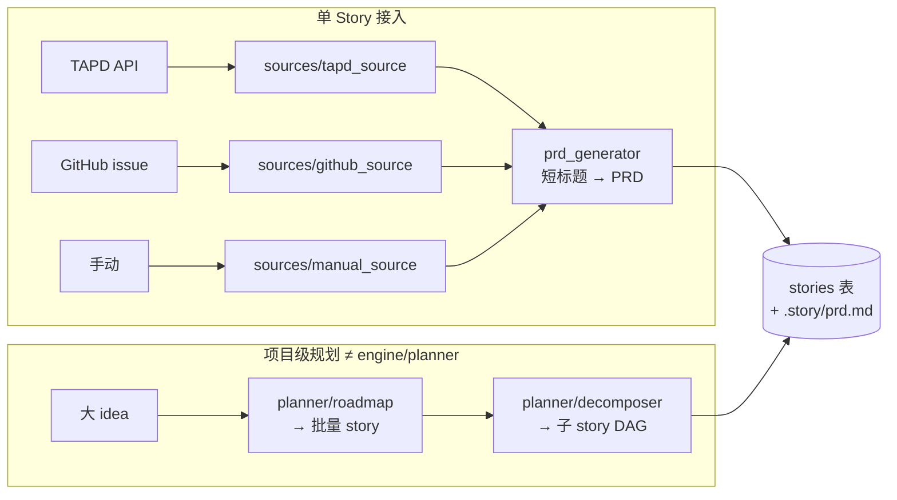
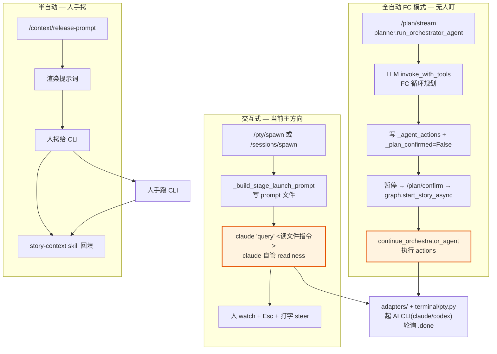
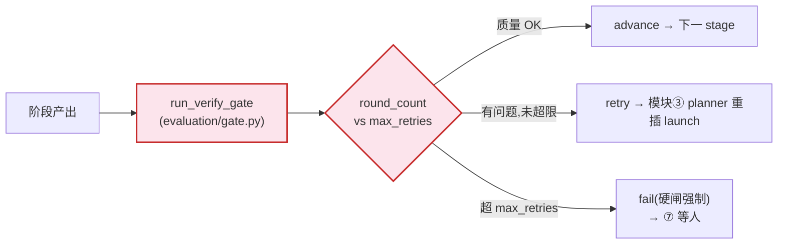
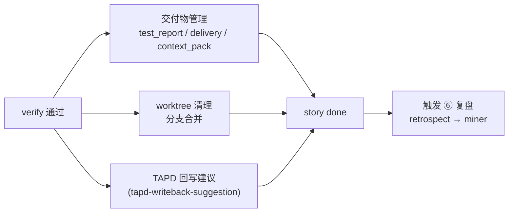
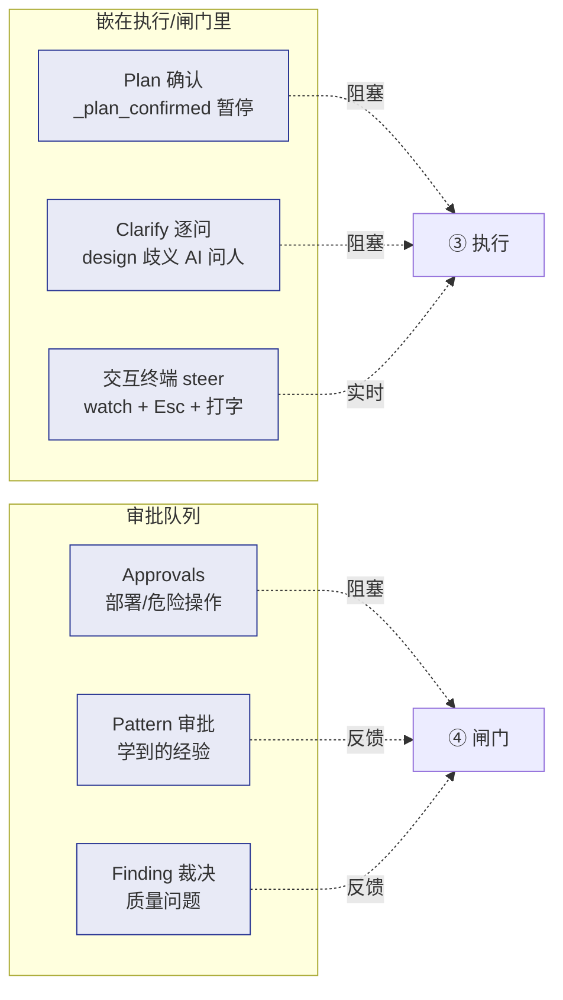

# 03 · 业务模块详解

> 7 个业务模块的职责、IO、代码落点、API。速查表见 [02-modules-overview.md](02-modules-overview.md)。

---

## 模块① · 需求接入(Intake)

**业务**:把外部需求转化成系统内的 Story 记录 + PRD 文档。

### 子能力



### 关键点

| 能力 | 说明 | 代码 |
|---|---|---|
| 多数据源 | TAPD/GitHub/手动,统一 `get_source()` 工厂 | `sourcing/sources/__init__.py:19` |
| PRD 生成 | 把简短标题扩成可执行需求文档 | `service/prd_generator.py` |
| 子 Story 拆分 | 复杂需求拆成带依赖的子任务,共享父知识库 | `POST /api/story/{parent}/sub` + `stage_graph` |
| **项目级规划** | idea→roadmap→story(**≠** engine/planner) | `sourcing/planner/` |

### 主要 API

`POST /api/story`(建)、`POST /api/story/{parent}/sub`(子)、`POST /api/intake/preview`(需求预览)、`POST /api/sync/tapd`(TAPD 同步)、`GET /api/bugs`(bug 列表)

### ⚠️ 业务边界
- **两个 planner 不是一回事**:`sourcing/planner`(项目级「造哪些 story」)vs `orchestrator/engine/planner`(story 内「这个 stage 怎么跑」)
- 本模块只管"把需求变成 Story 记录",不关心它怎么跑

---

## 模块② · 上下文装配(Context Assembly)

**业务**:AI 跑每个阶段前,把它需要的全部上下文打包好。质量的基础——喂得全才跑得对。

### 数据流

```mermaid
flowchart TB
    subgraph sources [上下文来源]
        A1[Story 记录]
        A2[项目画像<br/>project_profile]
        A3[知识飞轮<br/>scenario/playbook/failure]
        A4[transcript 历史<br/>{transcript_context}]
        A5[关联文档/变更项/bug]
    end

    subgraph resolver [ContextResolver 只读聚合]
        R["resolve(story_key)<br/>→ ContextBundle"]
    end

    subgraph out [输出]
        O1[prompt_*.md 文件]
        O2[release_prompt<br/>可拷给 CLI]
        O3[context pack<br/>交付用]
    end

    A1 & A2 & A3 & A4 & A5 --> R --> O1 & O2 & O3

    classDef ro fill:#e3f2fd,stroke:#1565c0
    class R ro
```

### 关键点

| 能力 | 说明 | 代码 |
|---|---|---|
| **只读聚合** | ContextBundle = story + projects + docs + change_items + artifacts + runtime_facts + profile | `context/resolver.py` |
| 知识注入 | `KnowledgeIndex.retrieve()` 拿 playbook/scenario/failure | `knowledge/context_providers/knowledge_provider.py` |
| transcript 注入 | `{transcript_context}` 占位填充(来自 miner) | `engine/prompt_sections.py:build_transcript_section` |
| release_prompt 渲染 | 半自动模式:渲染可拷给 AI 的提示词 | `context/release_prompt.py` |
| 打包 | context_pack 给交付或下游 | `context/pack.py`、`context/snapshot.py` |

### 主要 API

`GET/PUT /api/story/{key}/context`、`POST /context/refresh`、`/context/snapshot`、`/context/pack`、`POST /release-prompt`、`POST /context/documents`、`/context/change-items`、`PUT /context/branch`

### ⚠️ 业务边界
- **resolver.py 纯只读,零副作用**(注释明确:"Pure read operations. No writes, no side effects")
- 本模块不决策、不执行,只装配

---

## 模块③ · 执行编排(Execution)— 系统心脏

**业务**:驱动 AI CLI 走完一个阶段。**三种执行模式并存**,业务定位不同:



### 编排核心循环(FC 模式)

```
planner 规划 → _agent_actions 写队列 + _plan_confirmed=False(暂停)
   → 前端 confirm → graph.start_story_async
   → continue_orchestrator_agent 执行 actions
   → adapters/ + terminal/pty.py 起 AI CLI
   → 轮询 .done
   → gate.run_verify_gate 硬闸(模块④)
   → advance / retry / fail
```

### 关键点

| 能力 | 说明 | 代码 |
|---|---|---|
| **FC 规划循环** | LLM 自己生成 actions 队列(invoke_with_tools) | `engine/planner.py:run_orchestrator_agent` |
| 重规划 | 失败后 LLM 重插 launch action | `engine/replanner.py` |
| **多 CLI 适配** | claude/codex/shell,yml 配置统一 launch_cmd | `knowledge/adapters/` |
| PTY 进程管理 | spawn + readiness + I/O | `infra/terminal/pty.py`(铁律:不动) |
| Stage 推进 | advance / skip / fail / abort / resume | API 端点 + `engine/transition.py` |
| Stage 图 | 子 story 并行/依赖 DAG | `engine/stage_graph.py` |
| WebSocket 实时 | 终端流 + 状态推送 | `/ws/pty`、`/ws/story`、`/ws/stories` |

### 主要 API

`GET /plan/stream`(SSE 规划流)、`POST /plan/confirm`、`POST /plan/regenerate`、`POST /pty/spawn`、`POST /sessions/spawn`、`PUT /advance|skip|fail`、`POST /start`、`POST /abort`、`PUT /resume`、`POST /answer`、`GET /wait`

### ⚠️ 业务边界
- 本模块"执行",产出阶段产物(spec/代码/test_report),但**推进与否由模块④ gate 决定**
- **铁律:`pty.py` 不动**(`docs/handoff-design-hitl.md` 反复强调)
- **三种 claude 启动方式**:`-p` headless(自主)/ `claude "query"`(交互式自驱,当前主方向)/ release-prompt(人手拷)

---

## 模块④ · 质量闸(Quality Gate)

**业务**:每阶段产出必须过**硬闸**才能推进。质量保证 + 对抗循环的落地。

### 判定逻辑



### 关键点

| 能力 | 说明 | 代码 |
|---|---|---|
| **Gate 硬闸** | `round_count > max_retries` 代码强制 fail,**不可绕过** | `evaluation/gate.py` |
| 对抗审查(FC 内化) | FC 模式下由 LLM 自驱重试,**无 Python repair-loop** | `evaluator_loop.py` 只构造 packet |
| 质量飞轮 | Finding → accepted → fixed → verified → **learned Pattern** | `evaluation/quality.py`、`review_feedback.py` |
| Pattern 审批 | 学到的模式要人确认 | `/api/patterns/{id}/approve\|reject` |
| 语义层 | 活组件,quality + seed_pipeline 用 | `evaluation/semantic.py` |

### 主要 API

`POST /gate-results`、`GET /gate-history`、`GET /loop-trace`、`GET /debug`、`GET /findings`、`GET /quality`、`GET /api/patterns`、`PUT /api/finding/{id}/decide`

### ⚠️ 业务边界
- 本模块"裁判",只判定,**不改代码**
- retry 时由模块③ planner 重新插入 launch action
- **对抗循环在 FC 下被内化**:README 写的三角色 Python 循环是 LangGraph 时代的,现在 gate 硬闸兜底
- **gate 硬闸不可绕**:这是业务不变量

---

## 模块⑤ · 交付收尾(Delivery)

**业务**:验证通过后,把产物 + 上下文打包成交付资料,并收尾工作区、回写上游。



### 关键点

| 能力 | 说明 | 代码 |
|---|---|---|
| 交付物 CRUD | test_report / delivery / context_pack 三类 | `service/delivery.py` |
| worktree 收尾 | prepare / cleanup-preview / cleanup | `workspace/worktree/` |
| 上游回写 | 给 TAPD 写状态的建议 | `/tapd-writeback-suggestion` |

### 主要 API

`GET/POST/PUT /delivery-artifacts`、`POST /worktrees/prepare`、`GET /worktrees/cleanup-preview`、`POST /worktrees/cleanup`、`GET /tapd-writeback-suggestion`、`GET /context/pack`

### ⚠️ 业务边界
- 本模块是"出口",完成后**触发模块⑥知识沉淀**

---

## 模块⑥ · 知识飞轮(Knowledge Flywheel)— 跨包闭环

**业务**:让系统越用越聪明。monorepo 名字 `dev-flywheel` 的由来。**详解见 [04-knowledge-flywheel.md](04-knowledge-flywheel.md)。**

```
        lifecycle 写 anchors.jsonl
              │
              ▼
   miner 生产(离线):transcript → SQLite → 挖掘
     ├─ playbook(任务经验:debug/需求开发/SQL…)
     ├─ failure(失败避坑)
     ├─ scenario(业务结构,静态)
     └─ SFT 语料 / 工时预估 / 债务
              │ artifact JSON
              ▼
   knowledge 契约包(统一 INDEX:scenario+playbook+failure)
              │
              ▼  SOFT 缝(try/except)
   lifecycle context_provider 注入模块②
```

### 集成点 I1–I4(已完成)

| 点 | 业务 | 指标 |
|---|---|---|
| **I1** | 定时扫描(每日增量/每周全量) | `store --since 1` <10s |
| **I2** | 精确绑定(lifecycle 写 anchor → miner 读) | hc-all 绑定率 80.4% |
| **I3** | 上下文注入(`{transcript_context}` 自动进 prompt) | design/build/verify |
| **I4** | Done 复盘(`story done` 自动跑 retrospect) | `.story/done/<id>/retrospect.md` |

### ⚠️ 业务边界
- 2 个 **SOFT 缝**:miner / knowledge 包都是 optional,lifecycle 单独能跑
- `story_lifecycle/knowledge/`(层目录)≠ `packages/knowledge/`(契约包)

---

## 模块⑦ · 人机协同(HITL)— 横切

**业务**:让人能在 AI 自驱的全流程中介入。**四种介入粒度**,从轻到重:



### Clarify 两套实现(业务等价,场景不同)

| 实现 | 触发场景 | 代码 |
|---|---|---|
| **外接 MCP clarify** | headless `-p`(人不在的自主场景) | `orchestrator/mcp/clarify_server.py` |
| **交互终端问人** | 交互式 claude(无 MCP) | `prompt_sections.build_design_dimensions_section(interactive=True)` |

### 主要 API

`POST /plan/confirm`、`GET /api/approvals`、`GET/POST /clarify`、`/clarify/answer`、`/clarify/stream`、`PUT /api/patterns/{id}/approve|reject`、`PUT /api/finding/{id}/decide`、`WS /ws/pty`(交互终端)

### ⚠️ 业务边界
- **HITL 是横切,不是独立阶段**:嵌在模块③④里
- 交互终端这条路是最近 commits 的主战场(5 个 `fix(pty)` + 1 个 feat,见 [`docs/handoff-design-hitl.md`](../handoff-design-hitl.md))

---

## 支撑能力(横切,非业务主线)

| 能力 | 业务 | 代码 |
|---|---|---|
| **工作区隔离** | 每 story 独立 worktree + 分支,防互相踩 | `orchestrator/workspace/` |
| **项目画像** | 技术栈/约定/结构,注入 prompt | `workspace/project_profile/scan/probe` |
| **观测诊断** | 出问题能查 | `orchestrator/observability/`(debug_packet/diagnostics/events) |
| **SWE-bench 评测** | 离线批量跑引擎,量化好坏(工程自证) | `infra/benchmarks/` + `story swebench run` |
| **入口** | CLI / TUI / Web Board / serve(8180) | `entry/` + `orchestrator/service/api.py` |
