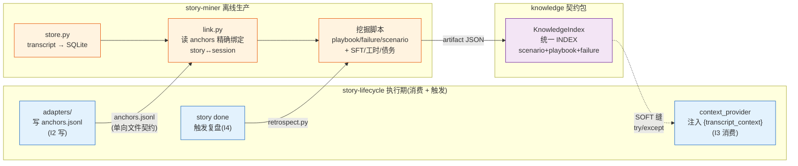
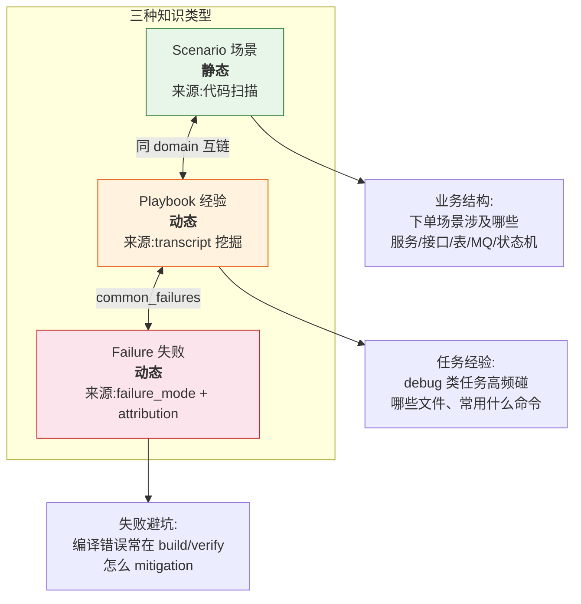
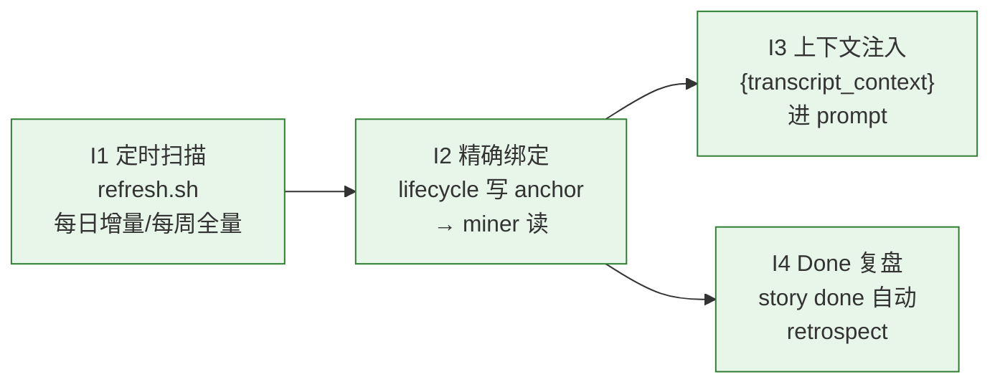
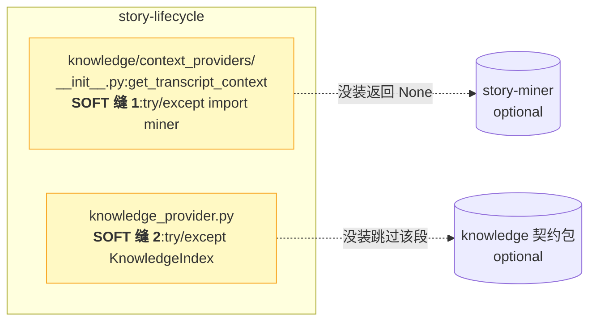
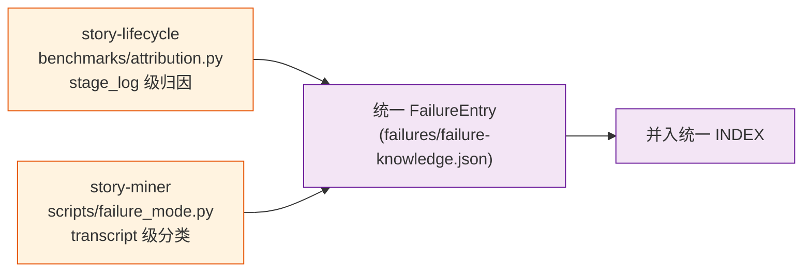

# 04 · 知识飞轮(Knowledge Flywheel)

> 模块⑥ 详解。这是 monorepo 名字 `dev-flywheel` 的由来,也是本项目的**差异化能力**——大多数 AI SDLC 编排器做编排但不闭环沉淀经验,本项目靠跨包飞轮让系统越用越聪明。
> Schema 细节见 [`packages/knowledge/schema.md`](../../packages/knowledge/schema.md),集成任务卡见 [`docs/INTEGRATION.md`](../INTEGRATION.md)。

## 闭环总览



**核心**:飞轮靠 **2 个 SOFT 缝** + **1 个文件契约**运转,跨包但松耦合——任何一包缺失,其余仍能跑。

## 三种知识语义(统一 schema)



| 类型 | source | 业务含义 | 示例 |
|---|---|---|---|
| **Scenario** | `static`(代码扫描) | 业务结构 | "下单场景涉及 OrderController + t_order + MQ.order.paid" |
| **Playbook** | `dynamic`(transcript) | 任务经验 | "debug 类任务高频碰 OrderService.java,常用 cli_sql 查库" |
| **Failure** | `dynamic` | 失败避坑 | "编译错误 12 次,mitigation:检查依赖版本/重新编译" |

三者通过统一 INDEX 的 `links` 字段**互链**(同 domain 的 scenario↔playbook 自动链,playbook 的 common_failures 链 failure)。

## 知识实体基座(KnowledgeEntry)

所有知识条目共享字段(`packages/knowledge/schema.md` §3):

| 字段 | 说明 | 飞轮作用 |
|---|---|---|
| `source` | `static` / `dynamic` | 区分代码扫描 vs transcript 挖掘 |
| `domain` | 业务域(order/payment) | 同域互链 |
| `trigger` | 触发条件(keywords/stage/story_key_prefix) | **agent 判断何时召回** |
| `must_read` | 必看文件 | 注入 prompt 给 AI |
| `source_refs` | 来源(文件:行号 或 session_id) | 可追溯 |

### Trigger 示例

```json
{
  "keywords": ["debug", "排查", "报错"],
  "stage": "design",
  "story_key_prefix": "tapd-",
  "workspace_keyword": "hc-all"
}
```

## 四个集成点(I1–I4)



| 点 | 业务 | 接口契约 | 验收 |
|---|---|---|---|
| **I1** | 定时扫描兜底(主力) | `store --since Nd` discover 层过滤 | `store --since 1` <10s |
| **I2** | story↔session 主动绑定 | lifecycle `inject_prompt` 写 `<ws>/.story/runs/<key>/anchors.jsonl`,miner `link.py` 读 | hc-all story-sign 绑定率 **80.4%** |
| **I3** | 历史上下文注入 | `TranscriptStoryContextProvider.get_context(key,ws,stage)` 填占位 | design/build/verify prompt 含相关历史 |
| **I4** | Done 复盘钩子 | `story done <key>` 调 `retrospect.py --story <key>` | `.story/done/<id>/retrospect.md` 自动产出 |

### I2 锚点契约(关键,跨包通信的唯一接口)

**单向文件契约**(非 import):lifecycle 写、miner 读。

```jsonl
{"story_key":"tapd-1065518", "stage":"design", "adapter":"claude", "cwd":"D:/hc-all", "ts":"2026-07-07T19:54:00", "prompt_hash":"..."}
```

miner `link.py` 优先用 `(cwd 匹配 ws) + (ts 之后该 cwd 的最近 session)` **精确命中**一个 session,回填 `story_id`。anchors 没覆盖的才退回启发式(标 low-confidence)。

## 2 个 SOFT 缝(跨包解耦的关键)



| 缝 | 位置 | 行为 | 作用 |
|---|---|---|---|
| **缝 1** | `context_providers/__init__.py` | `try: import miner except ImportError: return None` | miner 没装 → transcript 段为空,lifecycle 照跑 |
| **缝 2** | `knowledge_provider.py` | `try: from knowledge import KnowledgeIndex except ImportError: skip` | knowledge 包没装 → 知识段跳过,lifecycle 照跑 |

**不变量**:`context_providers` 的 miner 依赖必须 try/except;`KnowledgeIndex.retrieve()` 必须 try/except ImportError。lifecycle 不装 miner / story-knowledge 也要跑。

## 三个「knowledge」目录辨析(易混)

```
packages/knowledge/                          ← 契约包(统一 schema + INDEX + retrieve)
packages/story-miner/                        ← 生产者(transcript → 知识产物)
packages/story-lifecycle/src/story_lifecycle/knowledge/  ← 层目录(lifecycle 内知识子系统)
├── context_providers/                       ← SOFT 缝,消费 miner + knowledge 包
├── adapters/                                ← claude/codex/shell,写 anchors(I2)
└── knowledge_store/                         ← 项目级 .story/knowledge/ 读写(≠ 契约包)
```

| 目录 | 角色 | ≠ |
|---|---|---|
| `packages/knowledge/` | **契约包**(schema + INDEX 定义) | 另两个的实现 |
| `story_lifecycle/knowledge/` | **层目录**(lifecycle 内的知识子系统) | 契约包 |
| `story_lifecycle/knowledge/knowledge_store/` | `.story/knowledge/` 项目库读写(原顶层 `knowledge/`,ISS-012 改名) | 契约包 |

## miner 生产的业务产物

miner 离线挖掘的产物(均落 `scripts/out/` 或 `<ws>/.story/knowledge/`):

| 产物 | 脚本 | 用途 |
|---|---|---|
| 约束规则表 | `constraint.py` | code review / 上线前检查 |
| 技术债务清单 | `debt.py` | 定期清 TODO/FIXME |
| 自动复盘 | `retrospect.py` | 会话/Story 结束后复盘 |
| 任务上下文包 | `recommend.py --package` | 开新任务前注入历史 |
| SFT 语料 | `distill.py` | 模型微调(ShareGPT 格式) |
| 工作量预估 | `predict.py` | 排期/工时(P90 上界) |
| 失败避坑清单 | `failure_mode.py` | 提交/构建前检查 |
| 经验手册 | `generate_playbooks.py` | 任务类型粒度经验 |

详见 [`docs/ADOPTION.md`](../ADOPTION.md)。

## 失败知识合并(两个来源 → 统一 FailureEntry)



合并字段:`category` / `frequency{ws: count}` / `common_tools` / `stages_affected` / `mitigations` / `counterfactuals`。

## 数据红线

- `data/*.db`(transcripts.db)、`data/distill/`(SFT 语料)、`.story/runs/` 含**真实开发对话(金融 PII)**,**绝不入 git**(已 gitignore)
- `anchors.jsonl` 只含 story_key + ts(非 PII),可入库
- 开源的只有代码,数据留本地
