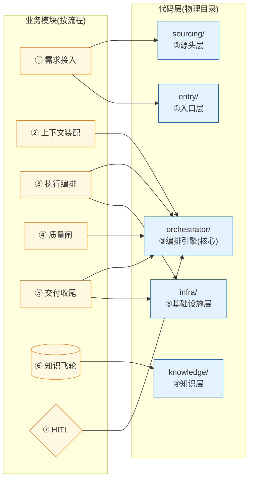

# 05 · 业务模块 ↔ 代码模块映射

> 把 **业务模块**(01–04,按需求到交付的流程)和 **代码模块**(`packages/story-lifecycle/docs/ARCHITECTURE.md` 的 5 层物理目录)联系起来。
> 这两套划分**正交**:一个业务模块横跨多个代码层,一个代码层服务多个业务模块。本文是双向查找表——从业务找代码,或从代码找业务。

## 为什么不直接移动 ARCHITECTURE.md?

`ARCHITECTURE.md` 描述的是 `packages/story-lifecycle/` 自己的代码分层,按 [`AGENTS.md`](../../AGENTS.md) 的约定("Package-level docs stay in the package")它留在包内。且它被 50+ 文件引用(含 `docs/archive/` 下 48 个 ADR),移动会大面积断链。

**正解:在这里建映射,不动原文件。** 本页所有代码链接都指向 [`packages/story-lifecycle/docs/ARCHITECTURE.md`](../../packages/story-lifecycle/docs/ARCHITECTURE.md)——那是代码分层的单一真相源。

## 映射总图



## 正向表:业务模块 → 代码落点

从业务模块查它实现在哪些代码层/目录。

| 业务模块 | 主代码层 | 具体目录/文件 | 业务做什么 |
|---|---|---|---|
| **① 需求接入** | `sourcing/` ② | `sources/`(TAPD/GitHub/手动)、`planner/`(项目级规划) | 外部需求 → Story 记录 |
| | `entry/` ① | `service/prd_generator.py`(PRD 生成) | 短标题 → PRD |
| **② 上下文装配** | `orchestrator/context/` ③ | `resolver.py`(只读聚合)、`release_prompt.py`、`pack.py` | AI 开工前喂上下文 |
| **③ 执行编排** | `orchestrator/engine/` ③ | `planner.py`(FC 循环)、`graph.py`、`router.py`、`execution.py` | FC 规划 + 执行 actions |
| | `infra/terminal/` ⑤ | `pty.py`(CLI 进程管理,**铁律不动**) | 起 AI CLI + 轮询 .done |
| | `entry/` ① | `service/api.py`(FastAPI 端点) | 对外暴露执行 API |
| **④ 质量闸** | `orchestrator/evaluation/` ③ | `gate.py`(硬闸)、`evaluator_loop.py`、`quality.py` | 判定 advance/retry/fail |
| **⑤ 交付收尾** | `orchestrator/service/` ③ | `delivery.py` | 交付物管理 |
| | `orchestrator/workspace/` ③ | `worktree/` | worktree 清理 |
| **⑥ 知识飞轮** | `knowledge/` ④ | `context_providers/`(SOFT 缝)、`adapters/`(写 anchors)、`knowledge_store/` | lifecycle 侧消费+触发 |
| | **跨包** | `packages/knowledge/`(契约)、`packages/story-miner/`(生产) | schema + 挖掘 |
| **⑦ HITL** | `orchestrator/engine/` ③ | `supervisor.py`(HITL 监督) | plan 确认 / clarify |
| | `orchestrator/` ③ | `mcp/clarify_server.py`(外接 MCP clarify) | headless 澄清 |
| | `entry/` ① | 前端 `TerminalPanel.tsx` + `/ws/pty` | 交互终端 steer |

## 反向表:代码层 → 服务哪些业务模块

从代码目录查它在支持哪些业务。这对理解"为什么这个代码层这么设计"有用。

| 代码层(物理目录) | 目录/文件 | 服务的业务模块 |
|---|---|---|
| **`entry/`** ① 入口层 | `cli/` | 所有模块(CLI 入口) |
| | `service/api.py` | ③ 执行编排、⑦ HITL(87 个端点) |
| | `service/prd_generator.py` | ① 需求接入 |
| | `profiles/*.yaml` | ③ 执行编排(工序配方) |
| | `web/` + 前端 | ⑦ HITL(交互终端) |
| **`sourcing/`** ② 源头层 | `sources/` | ① 需求接入 |
| | `planner/` | ① 需求接入(项目级规划) |
| | `integrations/` | ① 需求接入(gitlab 等) |
| **`orchestrator/`** ③ 编排引擎(核心) | `engine/` | ③ 执行编排、⑦ HITL(supervisor) |
| | `evaluation/` | ④ 质量闸 |
| | `service/`(delivery/story_service) | ⑤ 交付、③ 执行 |
| | `context/` | ② 上下文装配 |
| | `workspace/` | ⑤ 交付(worktree)、支撑(隔离) |
| | `observability/` | 支撑(诊断) |
| | `mcp/clarify_server.py` | ⑦ HITL |
| **`knowledge/`** ④ 知识层 | `context_providers/` | ② 上下文装配(注入)、⑥ 飞轮(SOFT 缝) |
| | `adapters/` | ③ 执行(起 CLI)、⑥ 飞轮(写 anchors) |
| | `knowledge_store/` | ⑥ 飞轮(.story/knowledge 读写) |
| **`infra/`** ⑤ 基础设施层 | `terminal/pty.py` | ③ 执行编排(CLI 进程) |
| | `db/models.py` | 所有模块(持久化汇合点) |
| | `prompts/*.md` | ③ 执行(prompt 模板) |
| | `benchmarks/` | 支撑(SWE-bench 评测) |

## 几个"映射热点"(业务与代码密集交织处)

这些地方业务模块和代码层耦合最紧,改一处要同时想两边:

### 热点 1:`knowledge/adapters/` 同时服务 ③⑥

```
adapters/ (claude/codex/shell)
├─ 业务③ 执行编排:adapter.launch_cmd() 起 AI CLI
├─ 业务⑥ 知识飞轮:inject_prompt() 写 anchors.jsonl(I2 绑定契约)
└─ 代码层④ 知识层:在 knowledge/ 下,但被 orchestrator/engine 调用
```

**改 adapter 要同时考虑**:执行路径(③)和 miner 绑定(⑥)。

### 热点 2:`context_providers/` 是业务②⑥的交汇点 + 2 个 SOFT 缝

```
context_providers/ (knowledge 层④)
├─ 业务② 上下文装配:往 prompt 注入知识
├─ 业务⑥ 知识飞轮:消费 miner 产物 + knowledge 契约包
├─ SOFT 缝 1:try/except import miner(没装返回 None)
└─ SOFT 缝 2:try/except KnowledgeIndex(没装跳过该段)
```

### 热点 3:`engine/supervisor.py` + `mcp/clarify_server.py` 是业务③⑦的交汇

```
业务③ 执行编排(claude 跑阶段)
   ↕ 阻塞/反馈
业务⑦ HITL(supervisor 决策 + clarify 问人)
```

supervisor 的 `decide_response` / `emit_clarification_request` 把 HITL 嵌进执行流(不是独立 stage)。

## 正交关系说明

**为什么是正交的?**

- **业务模块**回答:"从需求到交付,系统提供哪些业务能力?"(流程视角,时序的)
- **代码模块**(ARCHITECTURE.md 的 5 层)回答:"代码怎么组织才不循环依赖?"(结构视角,分层的)

举例:
- 业务模块③"执行编排"横跨 `orchestrator/engine/`(③) + `infra/terminal/`(⑤) + `entry/service/`(①) **三个代码层**
- 代码层④ `knowledge/` 同时服务业务②(注入)、③(起 CLI 的 adapter)、⑥(飞轮)**三个业务模块**

所以两套划分不能互相替代——业务模块帮你想"这个需求要改哪些业务能力",代码分层帮你想"这些改动怎么不破坏依赖方向"。**改任何代码前,两边的定位都要看。**

## 相关文档

- 代码分层真相源:[`packages/story-lifecycle/docs/ARCHITECTURE.md`](../../packages/story-lifecycle/docs/ARCHITECTURE.md)(5 层物理目录 + codemap + 不变量)
- 业务模块详解:[03-module-details.md](03-module-details.md)
- 业务流程:[01-business-flow.md](01-business-flow.md)
