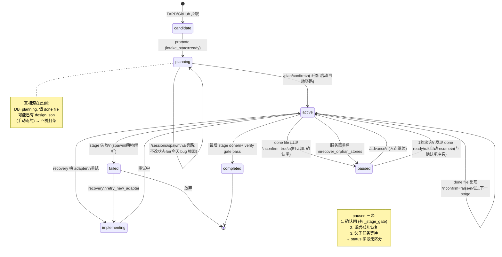
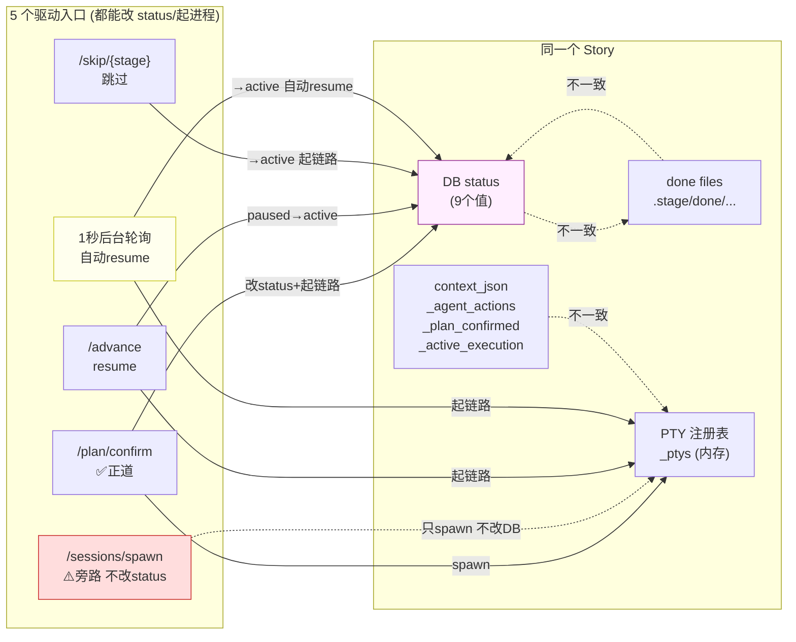
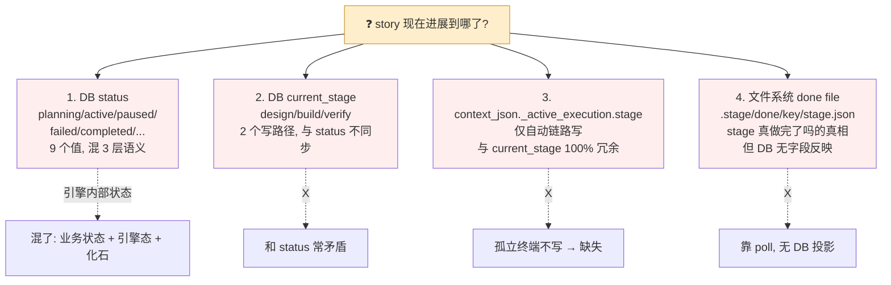
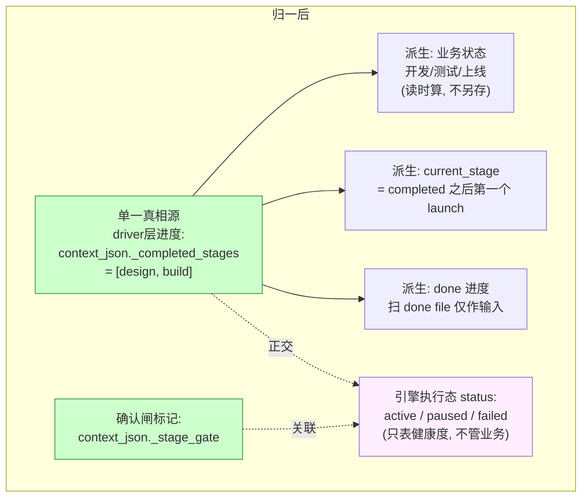
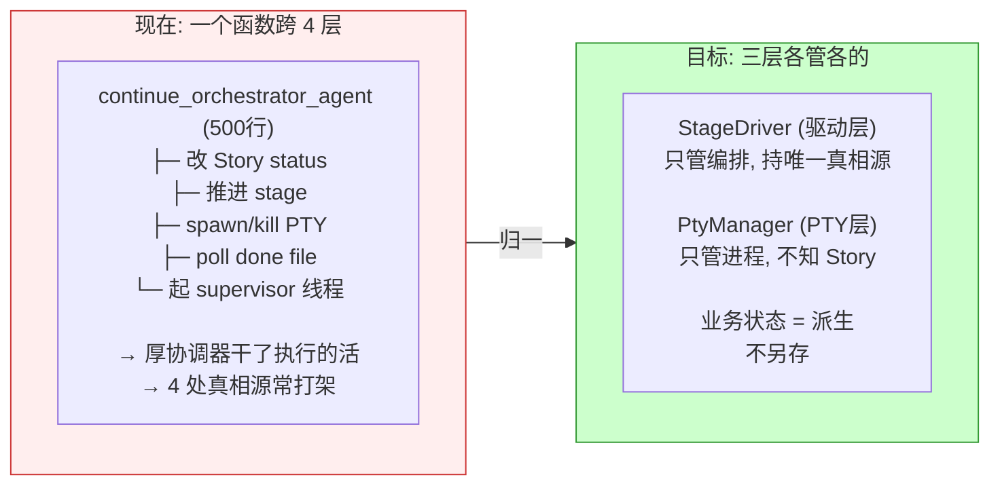

# 状态流程图（Mermaid）

> 现状还原，基于 STATE-MAP.md。GitHub/GitLab 原生渲染 Mermaid。
> 创建：2026-07-08。

---

## 1. 主状态转移图（status × 触发入口 → 新状态）



---

## 2. 5 个驱动入口（核心问题：无唯一调度者）



---

## 3. 4 处真相源（"story 进展到哪了"散在 4 处）



---

## 4. 归一目标：1 个真相源 + N 个派生视图



---

## 5. 三层分层（北极星，STATE-MAP 末尾）

```mermaid
flowchart TB
    subgraph 配置["配置层 (profile yaml) — 单一真相源"]
        CFG["阶段序列 / 转移规则 / 确认闸 / 重试上限\nconfirm, review, adversarial\n现状: 死配置(解析了从不读)\n目标: 代码不硬编码, 全从这读"]
    end

    subgraph 驱动["驱动层 (StageDriver) — 厚, 确定"]
        DRV["读配置 → 按阶段跑 → 推进状态机\n只管编排, 不碰 PTY 细节\n状态机: 设计done→开发→开发done→测试→...\n持有 _completed_stages (唯一真相源)"]
    end

    subgraph PTY["PTY 层 (PtyManager) — 薄, 无状态"]
        PTY["单进程生命周期: spawn/alive/kill/resume\n不知道 Story, 不知道阶段\n给命令就跑, 写 done 就算完"]
    end

    subgraph 业务["Story 业务状态 — 派生视图"]
        BIZ["开发 / 测试 / 上线\n从 _completed_stages 派生\n不另存字段"]
    end

    配置 -->|读| 驱动
    驱动 -->|起/读done| PTY
    驱动 -->|派生| 业务

    style 配置 fill:#fef,stroke:#939
    style 驱动 fill:#cfc,stroke:#393
    style PTY fill:#eef,stroke:#339
    style 业务 fill:#fec,stroke:#c93
```

---

## 6. 现状 vs 归一后对比（一句话总结）


